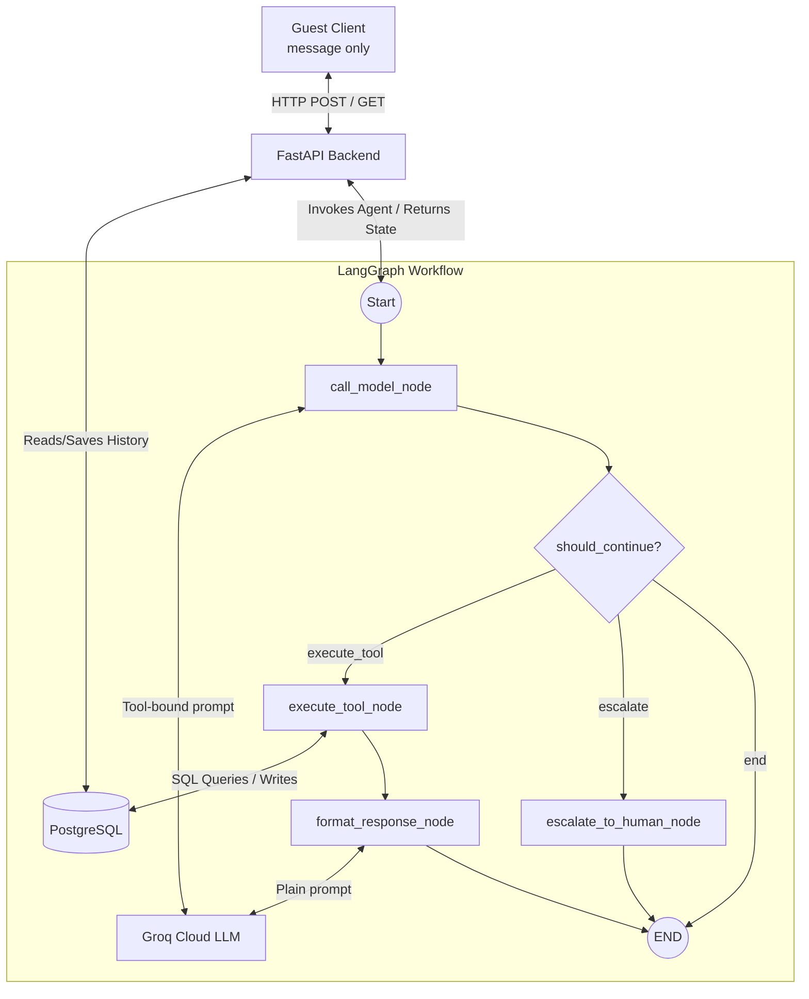

# StayEase Agent Architecture

This system is a message-only chat assistant for StayEase, a short-term rental platform in Bangladesh. The client sends only one text message per turn. FastAPI receives the message, LangGraph routes the request, Groq Cloud LLM determines whether to search, show details, book, or escalate, and PostgreSQL stores listings, bookings, and conversation history.

## 1.1 System Overview

## 1.2 Conversation Flow Example

Guest message:
"I need a room in Cox's Bazar for 2 nights for 2 guests"

1. Client calls POST /api/chat/{conversation_id}/message with only the message.
2. FastAPI appends the user text to conversation history and invokes LangGraph.
3. `call_model_node` sends the text to Groq Cloud. The model determines what data is collected and responds with structured tool calls if it has enough info.
4. If parameters (like check-out date) are missing, the agent asks a follow-up question directly instead of calling a tool.
5. `execute_tool_node` runs the `search_available_properties` tool, querying the listings table and excluding date-overlapping confirmed bookings.
6. `format_response` node uses a plain Groq Cloud LLM to format the raw tool output into a friendly response with BDT prices.
7. API returns the available properties and pricing, and stores both user and assistant messages.

## 1.2.1 Conversational flow example

[Visit this Doc](https://docs.google.com/document/d/17Gb4yq8R8Y7VVHcauZDiuFd4oUUvtekdCfjuNRzWlME/edit?usp=sharing)

## 1.3 LangGraph State Design

| Field            | Type                     | Why it is needed                                            |
| ---------------- | ------------------------ | ----------------------------------------------------------- |
| conversation_id  | str                      | Links each turn to one chat thread.                         |
| messages         | List[BaseMessage]        | Gives model the latest user text and limited context.       |
| intent           | Optional[str]            | Extracted from tool choices (search/details/book/escalate). |
| extracted_params | Optional[Dict[str, Any]] | Holds parameters for API schema compatibility.              |
| missing_fields   | Optional[List[str]]      | Holds missing required params for API schema compatibility. |
| tool_result      | Optional[Any]            | Holds tool execution output for final response formatting.  |
| final_response   | Optional[str]            | Stores guest-facing response generated by formatter.        |
| escalate         | bool                     | Marks when request must be handed to a human.               |

## 1.4 Node Design

Graph uses 4 nodes.

1. call_model_node
   What it does: Uses Groq LLM (tool-bound) to determine intent and evaluate if enough context is present to route to a tool, or if user needs to be prompted.
   State updates: messages, final_response, intent, escalate.
   Next node: execute_tool, escalate, or END.

2. execute_tool_node
   What it does: Runs the requested tool (search/details/book) using structured arguments from the LLM.
   State updates: messages (ToolMessages), tool_result.
   Next node: format_response.

3. format_response_node
   What it does: Uses a plain LLM to convert raw SQL tool output into a friendly summary.
   State updates: final_response, messages.
   Next node: END.

4. escalate_to_human_node
   What it does: Hard handoff node triggering human intervention protocols.
   State updates: escalate, final_response.
   Next node: END.

## 1.5 Tool Definitions

1. search_available_properties
   Input:

- location: str
- check_in: date
- check_out: date
- num_guests: int
  Output format:
- List[object] with id, name, location, price_per_night, max_guests, amenities.

2. get_listing_details
   Input:

- listing_id: int
  Output format:
- Object with listing profile (description, rules, host, address, price, amenities).

3. create_booking
   Input:

- listing_id: int
- guest_name: str
- guest_phone: str
- check_in: date
- check_out: date
- num_guests: int
  Output format:
- Object with booking_id, status, total_price_bdt, stay dates.

## 1.6 Database Schema Design

1. listings

- id SERIAL PRIMARY KEY
- name TEXT NOT NULL
- location TEXT NOT NULL
- description TEXT NOT NULL
- photos TEXT[] NOT NULL
- house_rules TEXT[] NOT NULL
- host_name TEXT NOT NULL
- address TEXT NOT NULL
- price_per_night INTEGER NOT NULL
- max_guests INTEGER NOT NULL
- amenities TEXT[] NOT NULL
- is_active BOOLEAN NOT NULL
- created_at TIMESTAMPTZ NOT NULL
- updated_at TIMESTAMPTZ NOT NULL DEFAULT NOW()

2. bookings

- id BIGSERIAL PRIMARY KEY
- booking_code TEXT UNIQUE NOT NULL
- listing_id INTEGER NOT NULL REFERENCES listings(id)
- guest_name TEXT NOT NULL
- guest_phone TEXT NOT NULL
- check_in DATE NOT NULL
- check_out DATE NOT NULL
- num_guests INTEGER NOT NULL
- total_price_bdt INTEGER NOT NULL
- status TEXT NOT NULL
- created_at TIMESTAMPTZ NOT NULL
- updated_at TIMESTAMPTZ NOT NULL DEFAULT NOW()

3. conversations

- id BIGSERIAL PRIMARY KEY
- conversation_id TEXT NOT NULL
- role TEXT NOT NULL
- content TEXT NOT NULL
- intent TEXT NULL
- escalate BOOLEAN NOT NULL
- created_at TIMESTAMPTZ NOT NULL

## Setup & Running (Local)

1. Create and activate a virtual environment.
2. Install dependencies:
   pip install -r requirements.txt
3. Create local env file:
   cp .env.example .env
4. Set `DATABASE_URL` and `GROQ_API_KEY` in the `.env` file.
5. Apply database schema:
   psql "$DATABASE_URL" -f sql/schema.sql
6. Start the API server:
   uvicorn api.main:app --reload

## Setup & Running (Docker)

1. Create your `.env` file with `DATABASE_URL` and `GROQ_API_KEY`.
2. _(Note: If your database is locally hosted, change `localhost` in the `DATABASE_URL` to `host.docker.internal` or your machine's IP address)._
3. Build and start the container:
   `docker compose up --build -d`
4. The API will be available at `http://localhost:8000`.
